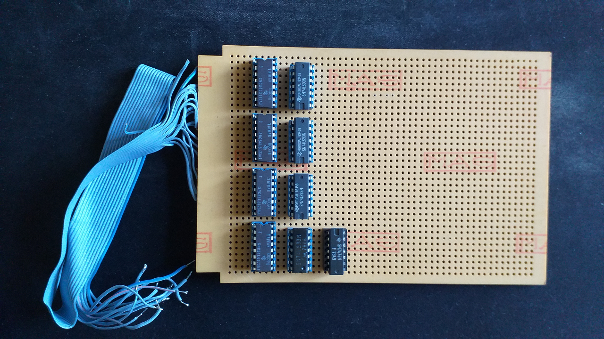

****** FRQMTR ******
====================
BY RADIO DELFI 1984

Un programma per trasformare il Commodore VIC-20 in un frequenzimetro
---------------------------------------------------------------------
Questo programma è stato sviluppato per collegare il VIC-20 a un dispositivo elettronico digitale capace di dividere la frequenza e inviare il segnale trattato alle porte del chip VIA 6522 in modo che sul monitor fosse mostrata la frequenza rilevata in ingresso. Il programma **FRQMTR.B** è scritto in BASIC Commodore.

Il proptotipo della scheda elettronica digitale è mostrato nella seguente immagine...

### VICE - the Versatile Commodore Emulator
FRQMTR è stato provato con l'emulatore VICE che può essere scaricato qui... http://vice-emu.sourceforge.net/, tuttavia non è stato creato nessun collegamento alla scheda elettronica digitale cosicché il programma fornisce letture senza senso dovute alla casualità del contenuto dei registri. Il codice BASIC può essere copiato ed incollato direttamente su VICE con la funzione *Edit/Paste*. Per comodità, nella cartella *tap* è inserito il file **frqmtr.tap** che può essere caricato ed eseguito con la funzione *Attach datasette image ...* di VICE.

### Archeologia informatica
FRQMTR non è stato testato in un ambiete reale. Il programma va utilizzato esclusivamente come esempio di programmazione pioneristica per l'impiego dei primi computer basati su microprocessore nel campo delle applicazioni finalizzate a creare una nuova classe di strumenti di misura basati su microcontrollori. 

Nella cartella *docs* sono presenti alcune scansioni di documenti originali dell'epoca in cui è presente del codice e gli schemi elettrici del dispositivo elettronico digitale di divisione. I documenti contengono varie stesure dei programmi ed appunti di progetto. Questi documenti sono stati inseriti per dimostrare che in mancanza di strumenti IDE e CAD la programmazione software e la progettazione di dispositivi elettronici era anche un esercizio di grande pazienza.